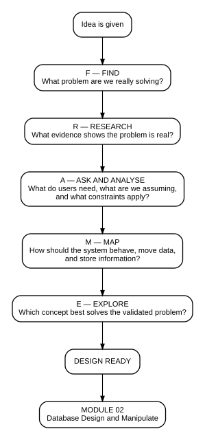

# Project 01 — Documentation and System Design

> **From a vague idea to a documented, traceable and build-ready system concept.**

**Career stage:** Software Engineering Candidate — Workplace Experience Phase  
**Portfolio focus:** Translating completed software-engineering training into professional, reviewable project evidence.

This is the first repository in my software-engineering learning journey.

My completed software-engineering training gave me a foundation in problem discovery, requirements thinking and system modelling.

In this repository I apply those foundations to a new portfolio case study using my own review process:

**Understand the problem → Validate what is needed → Model a build-ready system**

---

# 1. Problem

## Starting idea

Help software-engineering students, interns and newly employed junior developers move from study into a professional development environment without feeling lost when they receive unfamiliar tasks.

## Working problem statement

Developing software engineers may understand individual technologies but still struggle to apply them as one connected engineering process when facing an unfamiliar workplace task.

They may recognise frontend code, APIs, authentication, databases and testing independently, but not yet have a repeatable way to decide:

- where to begin;
- what evidence to inspect;
- what a result eliminates;
- what to investigate next;
- when to ask for help;
- how to explain what has already been checked.

> **Evidence boundary:** this remains a design hypothesis. Initial external FirstCommit research now includes two anonymised interviews from participants in the primary target-user group. Repeated supporting evidence has emerged for Assumption A1, but the wider problem hypothesis is not treated as universally validated from two qualitative interviews.

---

# 2. What Jeneane built

For Project 01, **the deliverable is the system design package — not a finished application**.

I created and organised:

- problem definition;
- stakeholder and scope analysis;
- research plan;
- candidate functional requirements;
- candidate non-functional requirements;
- user-interface requirements;
- business rules;
- decision log;
- traceability model;
- system context diagram;
- use-case model;
- DFD Level 0;
- DFD Level 1;
- ERD;
- low-fidelity workflow/wireframe;
- design-validation checklist;
- before-and-after reflection.

## FRAME

**F — Find the real problem**  
**R — Research the reality**  
**A — Ask and analyse**  
**M — Map the system**  
**E — Explore the concept**

My working rule:

> **Question → Evidence → Decision**

not:

> **Assumption → Feature**

The complete reasoning is in **[System Design Documentation](docs/System-Design-Documentation.md)**.

---

# 3. Technology

This repository is intentionally focused on **documentation and system design**, so the technology is lightweight.

| Purpose | Technology / Tool |
|---|---|
| Repository and documentation | GitHub + Markdown |
| Local review | VS Code |
| Diagram source | Mermaid |
| Diagram visual export | SVG |
| Manual visual modelling / future edits | draw.io where appropriate |
| Research/data-analysis experience carried from completed training work | Spreadsheet analysis |
| Version control / portfolio publication | Git |

No programming framework is presented as the main technology for this module because the core deliverable is the **design**, not an implemented application.

---

# 4. Technical decisions

### Decision 1 — Keep the problem statement solution-neutral
The design first asks whether the problem is real and which user need should be solved.

### Decision 2 — Separate facts, assumptions, questions, constraints and ideas
A client statement is not automatically treated as evidence.

### Decision 3 — Use traceability
**Need → Requirement → Use case → Process → Data → Interface**

### Decision 4 — Keep DFD levels balanced
DFD Level 1 decomposes **3.0 Investigate Scenario** into 3.1–3.5 without introducing unrelated logic.

### Decision 5 — Make diagram source reproducible
The source must be readable, the live render must be reviewed, and the final SVG must match the approved design. A screenshot alone is not enough.

### Decision 6 — Treat the ERD as a handoff, not the final database
Module 2 will challenge and implement the actual data model.

See **[Before and After](docs/Before-and-After.md)**.

---

# 5. Testing / Debugging

There is no running application to unit-test in Module 1.

Instead, I test and debug the **design artefacts**:

- Mermaid source opens correctly;
- visual exports match source;
- actor names stay consistent;
- requirements map to use cases;
- DFD processes support requirements;
- DFD Level 1 stays inside its Level 0 parent;
- DFD data stores correspond to ERD concepts;
- wireframe information exists in the requirements/data model;
- every important design element has a reason for existing.

See **[Design Validation](evidence/design-validation.md)**.

> **Module 1 debugging means finding contradictions before they become code.**

---

# 6. Security

Security in this project is **design-stage security**, not an implemented security feature set.

The concept considers:

- learner and reviewer role separation;
- authorised access as a future requirement;
- preventing reviewer-only answers from appearing in the learner workflow;
- keeping private training records and personal information out of the public repository;
- carrying security forward as a non-functional requirement for later implementation and testing.

I do **not** claim that authentication, encryption or production security controls are implemented in this Project 01 repository.

---

# 7. Deployment

There is no deployed application in Project 01.

The deployment target for Project 01 is:

> **A clean, reviewable GitHub design repository.**

It is intended to be opened in VS Code, reviewed from source, visually checked, version-controlled with Git and used as the design input for Module 2.

Application/cloud deployment becomes a core part of later portfolio projects.

---

# 8. Evidence

### Included
- editable Mermaid source;
- rendered SVG diagrams;
- consolidated system-design documentation;
- traceability;
- design-validation checklist;
- skills-carried-forward summary;
- authorship and provenance statement;
- before-and-after reflection;
- VS Code screenshot evidence.

### VS Code validation evidence
See **[VS Code Screenshot Evidence](evidence/screenshots/README.md)**.

See **[Authorship & Provenance](evidence/AUTHORSHIP-AND-PROVENANCE.md)** for how my original practical work was reviewed and professionally refined through AI-assisted mentoring.

Screenshots 01–09 have been captured and reviewed. Screenshot 09 is the approved System Design Documentation source + Markdown preview view. The evidence covers:

1. repository structure;
2. FRAME;
3. system context;
4. use case;
5. DFD Level 0;
6. DFD Level 1;
7. ERD;
8. wireframe;
9. system-design documentation.

### Not published
- lecturer or provider materials;
- original assessment briefs or supplied solutions;
- signed forms or private training records;
- personal identifiers;
- raw course archives;
- third-party code or portfolio templates.

---

# Design models

| Model | View |
|---|---|
| FRAME | [Open](diagrams/00-frame/frame.md) |
| System context | [Open](diagrams/01-system-context/system-context.md) |
| Use case | [Open](diagrams/02-use-case/use-case.md) |
| DFD Level 0 | [Open](diagrams/03-dfd/dfd-level-0.md) |
| DFD Level 1 | [Open](diagrams/03-dfd/dfd-level-1.md) |
| ERD | [Open](diagrams/04-erd/erd.md) |
| Wireframe | [Open](diagrams/05-wireframes/wireframe.md) |

---

# What this repository proves

> **Given an idea, I can question it, define the problem, identify what must be researched, turn needs into requirements, model the proposed system and prepare a clear handoff before implementation begins.**

---

# Next repository

**Module-02-Database-Design-and-Manipulate**

> **What data must this designed system remember, how should it be structured, and how will the application safely create, read, update and delete that data?**
