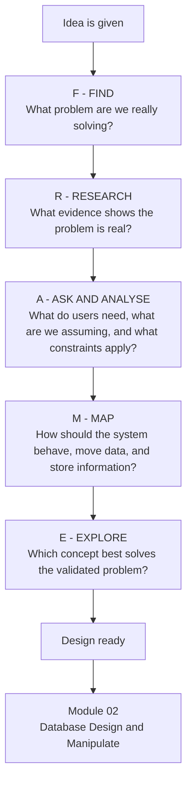

# FRAME — Idea to Design-Ready Concept

**Editable source:** [`frame.mmd`](./frame.mmd)  
**Visual export:** [`frame.svg`](./frame.svg)

> **Validation rule:** the model is accepted only when the editable source, rendered output, requirements, data model and related diagrams describe the same system.
