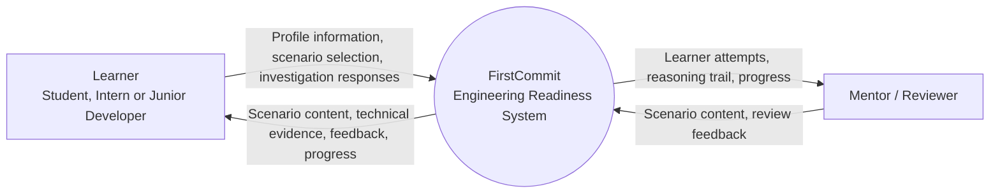

# System Context

**Editable source:** [`system-context.mmd`](./system-context.mmd)  
**Visual export:** [`system-context.svg`](./system-context.svg)

> **Validation rule:** the model is accepted only when the editable source, rendered output, requirements, data model and related diagrams describe the same system.
