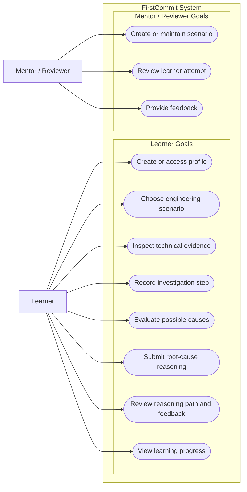

# Use-Case Model

**Editable source:** [`use-case.mmd`](./use-case.mmd)  
**Visual export:** [`use-case.svg`](./use-case.svg)

> **Validation rule:** the model is accepted only when the editable source, rendered output, requirements, data model and related diagrams describe the same system.
