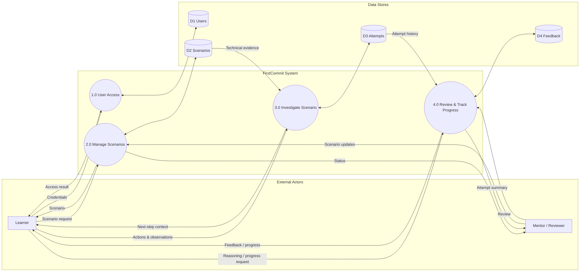

# Data Flow Diagram — Level 0

**Editable source:** [`dfd-level-0.mmd`](./dfd-level-0.mmd)  
**Visual export:** [`dfd-level-0.svg`](./dfd-level-0.svg)

> **Validation rule:** the model is accepted only when the editable source, rendered output, requirements, data model and related diagrams describe the same system.
