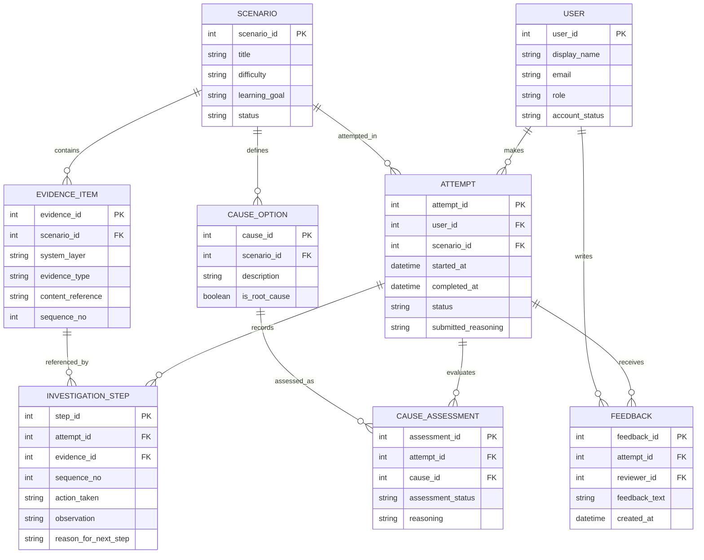

# Entity Relationship Diagram

**Editable source:** [`erd.mmd`](./erd.mmd)  
**Visual export:** [`erd.svg`](./erd.svg)

> **Validation rule:** the model is accepted only when the editable source, rendered output, requirements, data model and related diagrams describe the same system.
