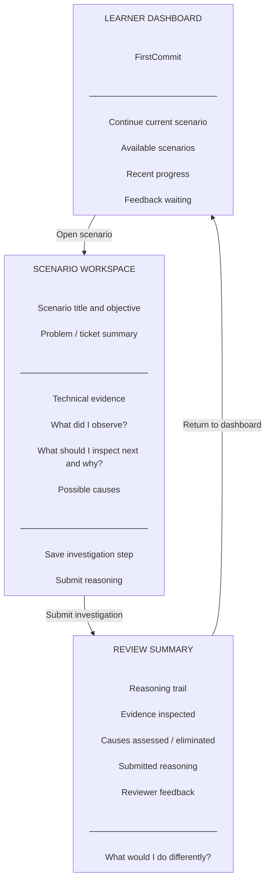

# Low-Fidelity Wireframe

**Editable source:** [`wireframe.mmd`](./wireframe.mmd)  
**Visual export:** [`wireframe.svg`](./wireframe.svg)

> **Validation rule:** the model is accepted only when the editable source, rendered output, requirements, data model and related diagrams describe the same system.
