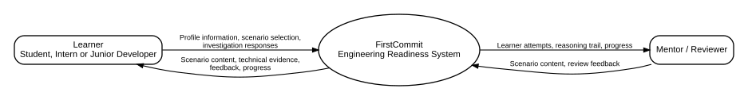
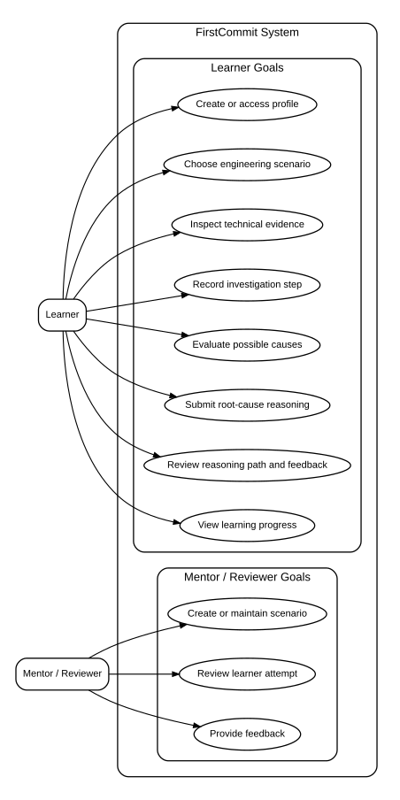
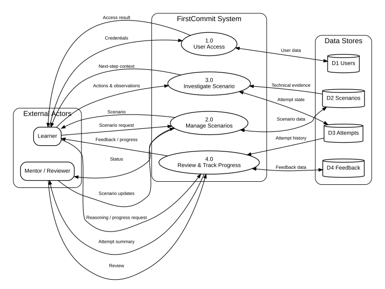
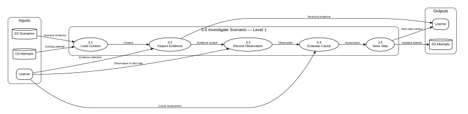
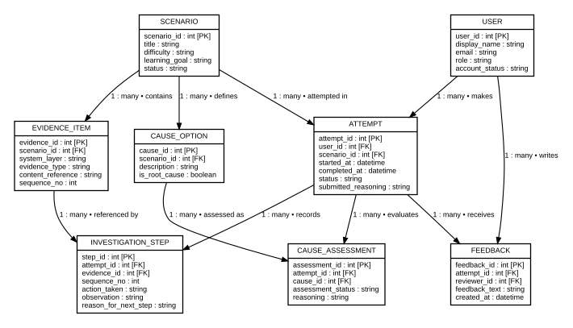
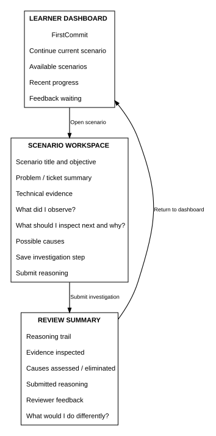

# FirstCommit — System Design Documentation

**Project:** 01 — Documentation and System Design  
**Design baseline:** v1.0 — VS Code reviewed  
**Portfolio stage:** Discover, document and design before implementation  
**Primary output:** A traceable system-design package for the FirstCommit concept
**Career stage:** Software Engineering Candidate — Workplace Experience Phase  
**Portfolio purpose:** Convert completed software-engineering training into professional evidence for internship and graduate-role applications.

---

## Executive summary

FirstCommit is a concept for helping developing software engineers practise the reasoning required when they encounter unfamiliar professional development tasks.

The design does **not** begin with a programming framework or a list of features. It begins with a problem hypothesis, research questions and a structured documentation process. The current design baseline then maps candidate needs into requirements, user goals, data flows, a conceptual data model and a low-fidelity interaction flow.

This repository demonstrates the first stage of my portfolio evidence chain:

> **Problem → What Jeneane built → Technology → Technical decisions → Testing/debugging → Security → Deployment → Evidence**

For Project 01, **what I built is the design package itself**. No running production application is claimed at this stage.

---

# 1 — PROBLEM

## 1.1 Starting idea

> Help software-engineering students, interns and newly employed junior developers move from study into a professional development environment without feeling lost when they receive unfamiliar tasks.

An idea is not yet a problem statement. The first engineering question is:

> **Why does this need to exist?**

## 1.2 Working problem statement

Developing software engineers may understand individual technologies but still struggle to apply them as one connected engineering process when they face an unfamiliar workplace task.

They may recognise frontend code, APIs, authentication, databases and testing independently, but not yet have a repeatable way to decide:

- where to begin;
- what evidence to inspect;
- what a result eliminates;
- what to investigate next;
- when to ask for help;
- how to explain what has already been checked.

This may result in slow task starts, random troubleshooting, unnecessary changes and dependence on senior guidance for basic investigation.

> **Evidence boundary:** this remains a problem hypothesis. External FirstCommit interviews, surveys or observational studies are planned research and are not presented as completed evidence.

## 1.3 Target users

Primary users:

- final-year software-engineering students approaching workplace learning;
- software-development interns;
- newly employed junior developers in their first professional development environment.

Current boundary:

> The concept is not intended to teach programming from zero. The target learner already has basic software-development foundations.

## 1.4 Stakeholders

| Stakeholder | Role | Main interest |
|---|---|---|
| Learner | Primary user | Practise how to investigate unfamiliar engineering problems |
| Mentor / Reviewer | Supporting user | Review a learner's reasoning and provide useful feedback |
| Training provider / educator | Possible stakeholder | Support workplace-readiness development |
| Development team / employer | Indirect stakeholder | Junior developers who investigate and communicate more systematically |

## 1.5 Scope

### In scope for the concept

- learner access/profile;
- engineering scenarios;
- technical evidence from different system layers;
- investigation-step recording;
- possible-cause evaluation;
- submitted reasoning;
- review feedback;
- progress/review summaries.

### Out of scope for Project 01

- production application code;
- production authentication implementation;
- live employer repositories;
- automatic code generation;
- AI assistant functionality;
- leaderboards;
- full learning-management-system functionality;
- cloud application deployment.

---

# 2 — WHAT JENEANE BUILT

I translated the practical foundations from my completed Documentation and System Design training into one connected professional design case study.

The repository now contains:

- a problem definition and scope boundary;
- stakeholder analysis;
- a research plan;
- facts/assumptions/questions/constraints/ideas separation;
- candidate user needs;
- functional requirements;
- non-functional requirements;
- UI requirements;
- business rules;
- design decisions;
- traceability from need to interface;
- FRAME visual;
- system context diagram;
- use-case model;
- DFD Level 0;
- DFD Level 1;
- ERD;
- low-fidelity wireframe;
- design validation and VS Code evidence.

The work is based on practical design abilities developed during completed software-engineering training, but the public repository presents a professional rebuild rather than the original training submissions.

---

# 3 — FRAME

FRAME is the portfolio thinking structure used to organise this rebuild. It is **not** presented as an official curriculum framework.

| Stage | Engineering question | Main output |
|---|---|---|
| **F — Find** | What problem are we really solving? | Problem hypothesis and scope |
| **R — Research** | What evidence shows the problem is real? | Research plan and evidence boundary |
| **A — Ask & Analyse** | What do users need, what are we assuming, and what constraints apply? | Needs, requirements and rules |
| **M — Map** | How should the system behave, move data and store information? | Context, use case, DFD, ERD and wireframe |
| **E — Explore** | Which concept best solves the validated problem? | Selected concept direction |

My working rule is:

> **Question → Evidence → Decision**

rather than:

> **Assumption → Feature**

---

# 4 — F: FIND THE REAL PROBLEM

## 4.1 Discovery questions

### Who?

- Which users struggle most: students approaching workplace learning, interns or newly employed junior developers?
- What software-development knowledge do they already have?
- Who else is affected when they become stuck?

### What?

- What does “not knowing what to do” look like during a normal development task?
- Is the difficulty a missing technical concept, or difficulty connecting several technologies and system layers?
- Can the learner explain what has already been investigated?

### When?

- During onboarding?
- During the first independent task?
- While debugging an unfamiliar problem?
- When opening an unfamiliar repository?

### Impact

- Does the learner take too long to determine a starting point?
- Do they make random changes before understanding the fault?
- Does the team spend unnecessary time directing basic investigation?

### Current approach

- What do learners currently use when stuck: documentation, search, course notes, AI tools, developer communities or experienced colleagues?
- What do those resources solve well?
- What is still missing?

## 4.2 Facts, assumptions, questions, constraints and ideas

| Type | Statement | Treatment |
|---|---|---|
| Personal learning evidence | Technologies can be learned separately and still require deliberate integration into one full-stack workflow | Useful context, not proof for all learners |
| Assumption A1 | Learners may know individual technologies but struggle to connect them when solving unfamiliar tasks | Must be validated |
| Assumption A2 | The first independent task may expose this difficulty more clearly than guided onboarding | Must be validated |
| Question Q1 | Which workplace situations create the most difficulty? | Research |
| Question Q2 | What do learners do before asking for help? | Research |
| Question Q3 | What influences whether they ask for help or continue investigating independently? | Research without leading the participant |
| Constraint C1 | The target user already has basic software-development foundations | Current scope decision |
| Idea I1 | Guided investigation scenarios | Concept candidate, not automatically a requirement |

## 4.3 Objectives

The concept should investigate whether a useful system can:

1. help a developing software engineer approach unfamiliar tasks systematically;
2. teach reasoning across frontend, API, backend, authentication and data layers;
3. encourage evidence-based debugging rather than random code changes;
4. help the learner communicate findings and next steps;
5. support reflection after an investigation.

## 4.4 Candidate success criteria

These are **design targets**, not validated business metrics.

- A learner can identify a next investigation action and explain why.
- The system preserves a visible reasoning trail.
- Scenario evidence can represent multiple system layers.
- The learner can distinguish an observation from an assumption.
- The learner can evaluate and eliminate possible causes.
- A mentor/reviewer can understand the learner's reasoning from the recorded attempt.

---

# 5 — R: RESEARCH THE REALITY

## 5.1 Research objective

Determine whether the problem is real, recurring and important enough to justify the concept, and identify which part of the transition problem should be solved first.

## 5.2 Research questions

| Research question | Why it matters | Proposed method |
|---|---|---|
| Where do developing engineers become stuck most often? | Defines the real problem | Short interviews |
| What happens during the first independent task? | Tests A2 | Interview / task walkthrough |
| How do learners currently find help? | Identifies existing approaches and gaps | Interview / survey |
| Can learners trace a fault across several system layers? | Tests investigation reasoning | Observed scenario |
| What affects help-seeking decisions? | Tests the confidence/help assumption without leading | Open-ended interview |
| Which technical environments should scenarios represent first? | Prevents arbitrary stack selection | Interviews / survey |

## 5.3 Research methods

### Short interviews

Ask the participant to describe a real situation rather than agreeing with a proposed solution.

Example prompts:

- Tell me about a development task where you did not know where to begin.
- What did you inspect first?
- What evidence changed your direction?
- What did you try before asking someone else?
- What do you wish you had understood before the task?

### Small survey

Use only after interviews reveal useful categories to measure, such as:

- confidence reading unfamiliar repositories;
- debugging confidence;
- difficult workplace situations;
- help resources used most often.

### Task walkthrough

Give a learner a small realistic technical problem and observe the **sequence of reasoning**, not only whether the final answer is correct.

## 5.4 Evidence status

No external FirstCommit interviews or surveys are claimed in this design baseline. Planned research remains clearly separated from research actually performed.

---

# 6 — A: ASK AND ANALYSE

## 6.1 Candidate user needs

| ID | Need |
|---|---|
| NEED-01 | A learner needs a repeatable way to approach an unfamiliar engineering problem. |
| NEED-02 | A learner needs to understand how different system layers connect during troubleshooting. |
| NEED-03 | A learner needs to record observations and reasoning, not only a final answer. |
| NEED-04 | A learner needs to evaluate and eliminate possible causes. |
| NEED-05 | A learner needs feedback that explains the quality of the reasoning path. |
| NEED-06 | A mentor/reviewer needs a clear record of how the learner investigated the problem. |

## 6.2 Candidate functional requirements

| ID | Requirement | Priority | Source |
|---|---|---:|---|
| FR-01 | The system should allow a learner to create or access a profile. | Medium | Concept need |
| FR-02 | The system should allow a learner to select an engineering scenario. | High | NEED-01 |
| FR-03 | The system should present technical evidence associated with different system layers. | High | NEED-02 |
| FR-04 | The learner should be able to record an investigation action, observation and reason for the next step. | High | NEED-03 |
| FR-05 | The learner should be able to evaluate possible causes during the investigation. | High | NEED-04 |
| FR-06 | The learner should be able to submit final reasoning for the investigated problem. | High | NEED-01 / NEED-04 |
| FR-07 | The system should preserve the learner's investigation trail. | High | NEED-03 / NEED-06 |
| FR-08 | A mentor/reviewer should be able to review an attempt and provide feedback. | Medium | NEED-05 / NEED-06 |
| FR-09 | The learner should be able to review completed attempts, feedback and progress. | Medium | NEED-05 |
| FR-10 | A mentor/reviewer should be able to create or maintain scenario content. | Medium | Concept maintenance |

## 6.3 Candidate non-functional requirements

| ID | Type | Requirement |
|---|---|---|
| NFR-01 | Usability | The main scenario workflow should be understandable to a user with basic software-development knowledge without separate platform training. |
| NFR-02 | Clarity | Technical evidence, observations, reasoning and feedback should be visually distinguishable. |
| NFR-03 | Reliability | Saved investigation steps must remain associated with the correct learner, scenario and attempt. |
| NFR-04 | Security | Learner, reviewer and scenario-answer information must only be available to authorised roles. |
| NFR-05 | Maintainability | New scenarios and evidence items should be addable without redesigning the whole data model. |
| NFR-06 | Compatibility | The concept should be suitable for normal laptop/desktop browser use. |
| NFR-07 | Traceability | Important design elements should trace back to a need or requirement. |

## 6.4 Candidate UI requirements

- learner dashboard showing available/current scenarios, progress and feedback status;
- scenario workspace showing the problem/ticket and technical evidence;
- investigation area for observation and next-step reasoning;
- possible-cause assessment area;
- save-investigation-step action;
- submit-reasoning action;
- review summary showing reasoning trail, evidence inspected, causes assessed and reviewer feedback.

## 6.5 Candidate business rules

- One attempt belongs to one learner and one scenario.
- Investigation steps are stored in sequence.
- Submitting final reasoning does not remove the earlier investigation trail.
- Feedback belongs to a specific attempt.
- Scenario evidence belongs to a defined scenario.
- Cause options belong to a defined scenario.
- Learner-facing views must not expose reviewer-only root-cause answers.

---

# 7 — M: MAP THE SYSTEM

## 7.1 System context

**Question answered:** Who interacts with FirstCommit and what information crosses the system boundary?

External actors:

- **Learner** — sends profile information, scenario selections and investigation responses; receives scenario content, technical evidence, feedback and progress.
- **Mentor / Reviewer** — maintains scenario content and supplies review feedback; receives learner attempts, reasoning trails and progress information.

## 7.2 Use-case model

**Question answered:** What goals must each actor be able to accomplish?

Learner goals:

- create/access profile;
- choose engineering scenario;
- inspect technical evidence;
- record investigation step;
- evaluate possible causes;
- submit reasoning;
- review reasoning path and feedback;
- view learning progress.

Mentor/reviewer goals:

- create/maintain scenario;
- review learner attempt;
- provide feedback.

The use-case model intentionally shows **actor goals rather than workflow order**. Process sequence is modelled in the DFD and wireframe instead.

## 7.3 DFD Level 0

**Question answered:** What are the major processes, data stores and information flows?

The final Level 0 model uses four high-level processes:

1. **1.0 User Access** — handles learner credentials/profile access and user data.
2. **2.0 Manage Scenarios** — supports learner scenario requests and mentor scenario maintenance.
3. **3.0 Investigate Scenario** — provides technical evidence and stores the evolving investigation attempt.
4. **4.0 Review & Track Progress** — uses attempt history and feedback data to support review and progress reporting.

Data stores:

- **D1 Users**
- **D2 Scenarios**
- **D3 Attempts**
- **D4 Feedback**

The Level 0 diagram was deliberately simplified during validation so it remains readable and does not carry Level 1 detail.

## 7.4 DFD Level 1 — Process 3.0

**Question answered:** What happens inside **3.0 Investigate Scenario**?

The decomposition is:

1. **3.1 Load Context** — loads scenario evidence and any existing attempt.
2. **3.2 Inspect Evidence** — presents selected technical evidence to the learner.
3. **3.3 Record Observation** — records the observation and intended next step.
4. **3.4 Evaluate Cause** — records the learner's cause assessment.
5. **3.5 Save Step** — persists the updated attempt and returns next-step context.

The diagram duplicates the learner and D3 attempt store on the input/output sides **only for visual readability**; they represent the same external actor and logical data store.

## 7.5 Entity Relationship Diagram

**Question answered:** What information must the future application remember?

### Entities

| Entity | Purpose |
|---|---|
| `USER` | Learner/reviewer identity, role and account status |
| `SCENARIO` | Scenario definition, difficulty, learning goal and status |
| `EVIDENCE_ITEM` | Technical evidence belonging to a scenario and system layer |
| `ATTEMPT` | One learner's attempt at one scenario, including final submitted reasoning |
| `INVESTIGATION_STEP` | Ordered investigation actions, observations and next-step reasons |
| `CAUSE_OPTION` | Possible causes defined for a scenario |
| `CAUSE_ASSESSMENT` | Learner assessment/reasoning against a possible cause during an attempt |
| `FEEDBACK` | Reviewer feedback associated with an attempt |

### DFD-to-ERD data mapping

| DFD store | ERD concepts |
|---|---|
| **D1 Users** | `USER` |
| **D2 Scenarios** | `SCENARIO`, `EVIDENCE_ITEM`, `CAUSE_OPTION` |
| **D3 Attempts** | `ATTEMPT`, `INVESTIGATION_STEP`, `CAUSE_ASSESSMENT` |
| **D4 Feedback** | `FEEDBACK` |

### Important modelling decision

`ATTEMPT` stores `submitted_reasoning`, not a second free-text copy of a root-cause answer. Structured possible causes and learner assessments remain in `CAUSE_OPTION` and `CAUSE_ASSESSMENT`.

This reduces the risk of two conflicting sources of truth.

## 7.6 Low-fidelity wireframe

**Question answered:** What must the learner see and do during the primary workflow?

The interaction is deliberately simple:

> **Learner Dashboard → Scenario Workspace → Review Summary → Dashboard**

The screens are traceable to the data model:

| Wireframe information | Data concept |
|---|---|
| Available/current scenario | `SCENARIO`, `ATTEMPT` |
| Technical evidence | `EVIDENCE_ITEM` |
| Observation / next-step reason | `INVESTIGATION_STEP` |
| Possible causes assessed | `CAUSE_OPTION`, `CAUSE_ASSESSMENT` |
| Submitted reasoning | `ATTEMPT.submitted_reasoning` |
| Reviewer feedback | `FEEDBACK` |

---

# 8 — TRACEABILITY

## 8.1 Need → requirement → design

| Need | Requirement | Use case | DFD | Data | Interface |
|---|---|---|---|---|---|
| NEED-01 Repeatable investigation | FR-02, FR-06 | Choose scenario; submit reasoning | 2.0, 3.0, 4.0 | `SCENARIO`, `ATTEMPT` | Dashboard, Workspace |
| NEED-02 Connect system layers | FR-03 | Inspect technical evidence | 3.0 / 3.2 | `EVIDENCE_ITEM` | Evidence area |
| NEED-03 Record reasoning | FR-04, FR-07 | Record investigation step | 3.0 / 3.3 / 3.5 | `INVESTIGATION_STEP` | Investigation area |
| NEED-04 Evaluate causes | FR-05 | Evaluate possible causes | 3.0 / 3.4 | `CAUSE_OPTION`, `CAUSE_ASSESSMENT` | Cause area |
| NEED-05 Receive useful feedback | FR-08, FR-09 | Review feedback / progress | 4.0 | `FEEDBACK` | Review Summary |
| NEED-06 Review reasoning trail | FR-07, FR-08 | Review learner attempt | 4.0 | `ATTEMPT`, `INVESTIGATION_STEP` | Reviewer view / Review Summary |

## 8.2 Cross-diagram consistency rules

The design is accepted only when:

- actor names mean the same thing across context and use-case models;
- use cases trace to candidate requirements;
- DFD processes support the documented user goals;
- Level 1 decomposes only its Level 0 parent process;
- DFD data stores map to ERD concepts;
- wireframe information exists in the requirements and data design;
- source files render correctly and remain editable.

---

# 9 — TECHNOLOGY

| Purpose | Tool / format | Why used in this stage |
|---|---|---|
| Documentation | Markdown | GitHub-readable, versionable documentation |
| Local review | VS Code | Source editing and side-by-side visual validation |
| Editable diagram source | Mermaid (`.mmd`) | Text-based, versionable models |
| GitHub diagram rendering | Mermaid fenced blocks in `.md` | Keeps diagrams reviewable from source |
| Visual exports | SVG | Scalable portfolio visuals |
| Version control / publication | Git / GitHub | Repository evidence and change history |
| Earlier research-analysis experience | Spreadsheet analysis | Demonstrates data-to-requirement reasoning carried into this rebuild |

No programming framework is claimed as the primary technology in Project 01 because the deliverable is the **documentation and system design**, not an implemented application.

---

# 10 — TECHNICAL DECISIONS

## TD-01 — Keep the problem solution-neutral

The design does not begin by choosing React, Flask, a database or AI functionality. Technology selection should follow validated needs and later implementation constraints.

## TD-02 — Separate evidence from assumptions

A client statement, personal experience or attractive idea is not automatically treated as validated evidence.

## TD-03 — Use traceability before implementation

The design follows:

> **Need → Requirement → User goal → Process → Data → Interface**

## TD-04 — Keep Level 0 high-level

The Level 0 DFD was reduced to four major processes. Investigation detail belongs in Level 1 rather than overcrowding the context of the whole system.

## TD-05 — Balance DFD Level 1 with Process 3.0

Level 1 only decomposes investigation behaviour. Login, mentor feedback administration and unrelated progress logic are kept outside Process 3.0.

## TD-06 — Avoid duplicated root-cause data

The ERD stores final `submitted_reasoning` on the attempt while possible causes and assessments remain structured separately.

## TD-07 — Make diagrams reproducible

A diagram is not considered complete because a screenshot looks correct. The editable source must also open and render.

---

# 11 — TESTING / DEBUGGING THE DESIGN

There is no running application to unit-test in Project 01. The testing activity at this stage is **design validation**.

## 11.1 VS Code review completed

The following source-and-visual checks were completed in VS Code:

| Evidence | Review result |
|---|---|
| Repository structure | Confirmed clean folder structure |
| FRAME | Wording corrected and live Mermaid rendering confirmed |
| System context | Information-flow labels simplified and reviewed |
| Use case | Workflow-style arrows removed; actor goals separated |
| DFD Level 0 | Reduced to readable high-level processes and data stores |
| DFD Level 1 | Balanced to Process 3.0 and reorganised for readable input → process → output flow |
| ERD | Keys/relationships reviewed; `submitted_root_cause` changed to `submitted_reasoning` |
| Wireframe | Rebuilt from many tiny nodes into three readable low-fidelity screens |

## 11.2 What debugging looked like in Project 01

The debugging loop was:

> **Render → inspect → find contradiction/readability issue → change source → re-render → validate against other models**

Examples of problems found and corrected:

- wording that was grammatically unclear in FRAME;
- context-flow labels that were too detailed;
- use-case arrows that incorrectly implied workflow sequence;
- DFD Level 0 that carried too much low-level detail;
- DFD data-store directions that could imply unnecessary writes;
- DFD Level 1 layouts that obscured the 3.1 → 3.5 sequence;
- an ERD field that duplicated the concept of root-cause data;
- a wireframe that was technically present but unreadable as a portfolio visual.

This is the Project 01 meaning of debugging:

> **Find contradictions before they become code.**

---

# 12 — SECURITY

Security is currently represented as a **design requirement and boundary**, not as implemented production controls.

Current security considerations:

- learner and reviewer roles are separated;
- reviewer-only scenario answers should not be exposed to the learner workflow;
- learner/reviewer information should only be available to authorised roles;
- public GitHub evidence excludes private training records, personal identifiers and original assessment materials;
- secrets, credentials and tokens are not part of this repository;
- authentication, authorisation, secure session handling and production data protection must be implemented and tested in later modules.

No claim is made that encryption, production authentication or penetration testing has been implemented in Project 01.

---

# 13 — DEPLOYMENT

There is no deployed application in this stage.

The deployment target for Project 01 is:

> **A clean, reviewable GitHub design repository.**

The repository is prepared to be:

- opened in VS Code;
- reviewed from editable source;
- visually checked through SVG and Mermaid rendering;
- version-controlled with Git;
- published on GitHub;
- used as the design input for Module 02.

Application and cloud deployment are intentionally deferred to the later application-development stage.

---

# 14 — EVIDENCE

## 14.1 Source and visual evidence

Each design model has:

- `.mmd` editable Mermaid source;
- `.md` GitHub-renderable Mermaid wrapper;
- `.svg` visual export.

## 14.2 VS Code screenshots

| No. | Evidence file | What it proves |
|---:|---|---|
| 01 | `evidence/screenshots/01-vscode-project-structure.png` | Repository opens with the intended professional structure |
| 02 | `evidence/screenshots/02-frame-source-and-visual.png` | FRAME source and live render agree |
| 03 | `evidence/screenshots/03-system-context-source-and-visual.png` | Context source and reviewed information flows |
| 04 | `evidence/screenshots/04-use-case-source-and-visual.png` | Actor goals and system boundary |
| 05 | `evidence/screenshots/05-dfd-level-0-source-and-visual.png` | High-level processes and data stores |
| 06 | `evidence/screenshots/06-dfd-level-1-source-and-visual.png` | Process 3.0 decomposition and readable reasoning flow |
| 07 | `evidence/screenshots/07-erd-source-and-visual.png` | ERD source, PK/FK fields and relationships |
| 08 | `evidence/screenshots/08-wireframe-source-and-visual.png` | Main learner screen flow |
| 09 | `evidence/screenshots/09-system-design-documentation.png` | Final documentation source + Markdown preview |

The screenshots are supporting evidence. They do not replace the editable source files.

## 14.3 Evidence deliberately excluded from the public repository

- lecturer/provider materials;
- original assessment briefs or supplied solutions;
- raw course ZIP files;
- private training identifiers;
- phone number;
- signatures;
- private correspondence or feedback.

---

# 15 — E: EXPLORE THE CONCEPT

## 15.1 Concept options considered

### Option A — Static workplace-readiness checklist

**Strength:** simple to deliver.  
**Weakness:** can tell the learner what to do without developing investigation reasoning.

### Option B — Mentor journal

**Strength:** supports reflection and communication.  
**Weakness:** can depend heavily on mentor availability.

### Option C — Guided engineering investigation scenarios

**Strength:** allows the learner to practise evidence-based reasoning across realistic system layers.  
**Weakness:** good scenarios and feedback require careful maintenance.

## 15.2 Selected concept direction

**Guided engineering investigation scenarios** remain the preferred concept direction for this design baseline.

Reason:

> The possible problem is not merely remembering technology definitions. The system should help the learner practise deciding **what to inspect next and why**.

The direction remains open to change when actual user research is performed.

## 15.3 Ideas deliberately not promoted to requirements

- AI assistant;
- gamification;
- badges;
- leaderboards;
- live GitHub integration;
- live employer codebases.

These may be future possibilities, but the current evidence does not justify them as requirements.

---

# 16 — HANDOFF TO MODULE 02

Module 02 should not begin by inventing random database tables.

It begins with the approved design question:

> **What information must this system remember, how should it be structured, and how will the application safely create, read, update and delete that data?**

The Project 01 ERD is therefore a **conceptual design baseline**, not the finished database.

Module 02 should challenge and implement:

- entity boundaries;
- primary and foreign keys;
- cardinalities;
- normalisation;
- SQL schema design;
- constraints;
- CRUD operations;
- query design;
- relational vs NoSQL decisions where justified;
- secure data-access practices.

---

# 17 — REFLECTION

Documentation is not paperwork added after development. It makes engineering reasoning visible before code becomes expensive to change.

System design is not drawing unrelated diagrams because a task asks for them. Each model answers a different question:

- **Context** → Who interacts with the system and what crosses the boundary?
- **Use case** → What is each actor trying to accomplish?
- **DFD** → How does information move through processes and stores?
- **ERD** → What information must the system remember and how is it related?
- **Wireframe** → What must the user see and do?

The most important lesson carried forward is:

> **Do not start with the solution. Earn the solution by understanding the problem.**
